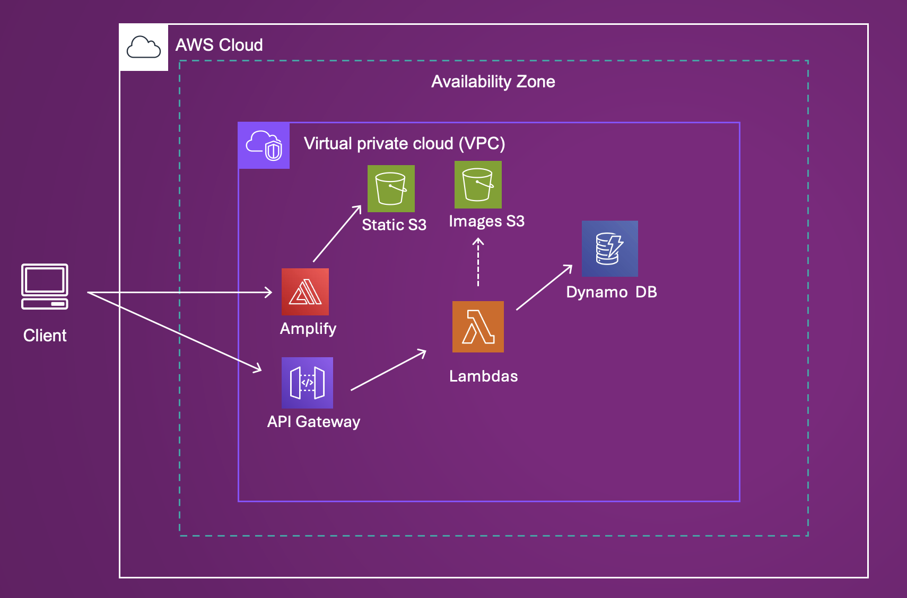

# Features

<!-- TODO: BingoMaker Branding -->

::: incremental

* Play bingo
* Create bingo tile pools
* Save bingo cards
* Print bingo cards
* Edit bingo cards
* Share bingo cards

:::

::: notes
Yousuf

:::

# System Architecture
## 



::: notes
Yousuf


* Amplify: Hosts static frontend assets 
* API Gateway: Routes client requests to backend Lambda functions.
* Lambda: Executes backend logic for creating bingo boards and managing data.
* DynamoDB: Stores game data
* Static S3 Bucket: Hosts pre-generated assets and static files for the application.
* Images S3 Bucket: Stores user-uploaded images or icons for custom boards
:::

# Demo

::: notes
Derek

:::

# New Technologies

## UV

{ width=200px }

::: notes
JP

* pip replacement and project manager
* similar to npm and npx
* supports the dependency grouping
    * use to install only what is required for lambdas
    * (segue into lambda layers)
:::


## Lambda Layers

. . .

{ height=565px }

::: notes
JP

* reuse shared dependencies across lambdas
* supports versioning
:::

## 

<div class="columns" style="align-items: center;">
::::: {.column width=45%}

:::::
::::: {.column width=5%}
<b>+</b>
::::
::::: {.column width=45%}

:::::
</div>

::: notes
JP

* locally run some aws service
* does not support all aws services
    * some require a premium subscriptions
    * (segue into terraform)
:::

## 


::: notes
Owen

* open-source infrastructure as code
* almost 5000 different providers
* cloud orchestration, similar to cloudformation
* allows us to almost have single `up`/`down` commands

:::

# Automation and Scripting

## Makefiles

. . .

```makefile
lint:
    uv run ruff check

test:
    uv run pytest

remote-deploy: deploy/.terraform
    terraform -chdir=deploy apply -auto-approve

deploy/.terraform:
    terraform -chdir=deploy init
```

::: notes
JP

* used a makefile to simplify
    * zipping lambda layers
    * local testing
    * local linting
* also had targets for
    * remote distributed deploy
    * remote distributed destroy using terraform
    * local monolithic deploy
:::

## GitHub Actions


<div style="display: flex; justify-content: center; margin: 0;">
  <p style="display: flex; align-items: center; margin: 0;">
    
    <b>2 checks passed</b>
  </p>
</div>

::: notes
Owen

* automatic linting and testing
* performed on a push
* in the future could be used to automate deployment
    * given restrictions of the learner lab, this could not be implemented
:::

## Terraform

. . .

```terraform
resource "aws_dynamodb_table" "bingo_maker" {
  name         = "BingoMaker"
  hash_key     = "id"

  attribute {
    name = "id"
    type = "S"
  }
}


```
::: notes
Owen

* initially had some scripts using aws cli, hard to maintain for a 1 command deploy

* makes dep tree automatically so services are started in corrected order 
    * amplify issue 

* here's a snippet, showing how easy it is to create a dynamodb table
    * has name, hash key, and our attribute
    * there are more options, but this is all thats required
:::


# Lessons Learned

::: incremental

* collaboration
* read documentation
* no, don't have ChatGPT read it **READ THE DOCS**

:::

::: notes
Everyone
<!-- JP: I think it's best if we all list at least one take away -->

* Group: integrate changes fast and often
* JP: **READ THE OFFICIAL DOCS, NOT STACK OVERFLOW**
    * localstack issue
    * boto3 client issue
* Derek: working while waiting for changes
* Yousuf: Lab permissions
    * documentdb
* Owen: communicating the status of changes
    * started having meetings later into the project, we should have had them to begin with
    * some PRs with unknown status
:::

# Future Work

::: incremental

* Cognito
* Images in tiles

:::

::: notes
Yousuf

* Cognito
* Images

:::
